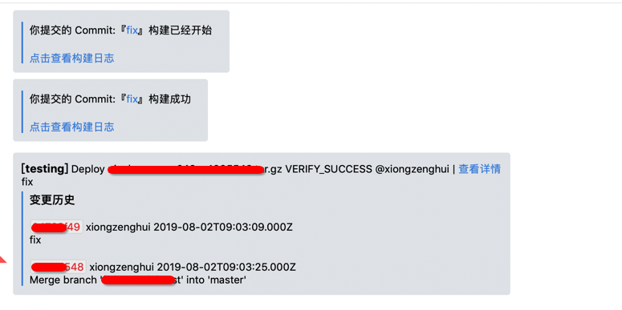
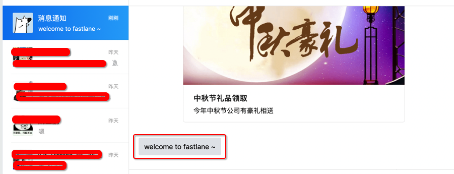
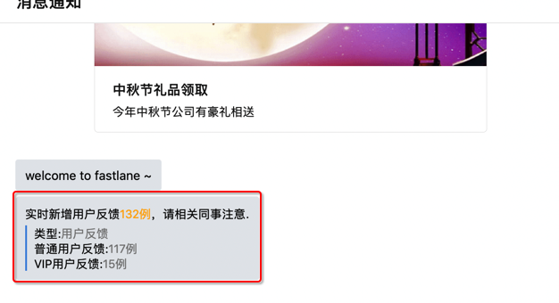
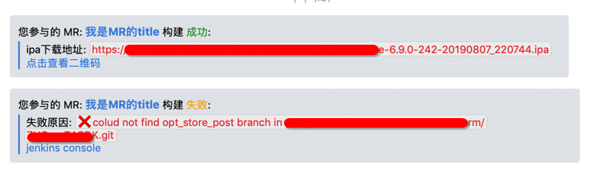
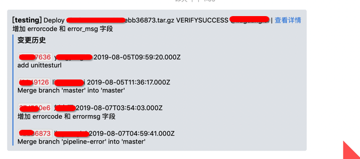
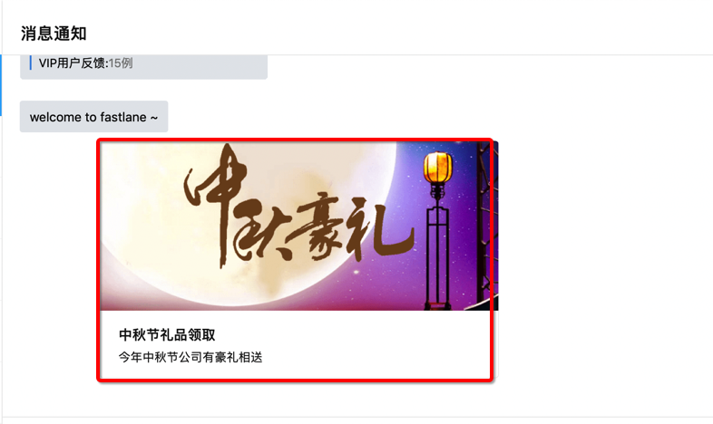

# wechat plugin

[](https://rubygems.org/gems/fastlane-plugin-wechat)

## Getting Started

This project is a [_fastlane_](https://github.com/fastlane/fastlane) plugin. To get started with `fastlane-plugin-wechat`, add it to your project by running:

```bash
fastlane add_plugin wechat
```

## About wechat

this is a wechat api wrapper

通常在各种流程结束时， 需要将结果发送出去，比如 slack … 目前因公司内部全部迁移到 企业微信，所以需要使用 企业微信 的 api 封装下，完成下面的通知 ~



如果你也需要，参考下面目前支持的 消息类型.

## Example

### 1. text 文本 类型

```ruby
wechat(
  access_token: 'your wechat api token', # 注意: 这个 token 必须每次重新请求获取, 不能长时间使用
  agentid: 'your wechat api agentid',
  recievers: ['xiongzenghui'],
  msgtype: 'text',
  text: 'welcome to fastlane ~',
  send_message_url: "http://smsc.in.xxx.com/message/send?userid=wangfei"
)
```



### 2. markdown 类型

```ruby
wechat(
  access_token_url: 'http://smsc.in.xxx.com/token',
  agentid: 'your wechat api agentid',
  secret: 'your wechat api secret',
  recievers: ['xiongzenghui'],
  msgtype: 'markdown',
  text: "实时新增用户反馈<font color=\"warning\">132例</font>，请相关同事注意.\n >类型:<font color=\"comment\">用户反馈</font>\n >普通用户反馈:<font color=\"comment\">117例</font>\n >VIP用户反馈:<font color=\"comment\">15例</font>",
  send_message_url: "http://smsc.in.xxx.com/message/send?userid=xiongzenghui"
)
```



**has more style like this:**



-----------




### 3. news 图文类型

```ruby
wechat(
  access_token_url: 'http://smsc.in.xxx.com/token',
  agentid: 'your wechat api agentid',
  secret: 'your wechat api secret',
  recievers: ['xiongzenghui'],
  msgtype: 'news',
  articles: [{
    "title" => "中秋节礼品领取",
    "description" => "今年中秋节公司有豪礼相送",
    "url" => "http://res.mail.qq.com/node/ww/wwopenmng/images/independent/doc/test_pic_msg1.png",
    "picurl" => "http://res.mail.qq.com/node/ww/wwopenmng/images/independent/doc/test_pic_msg1.png"
  }],
  send_message_url: "http://smsc.in.xxx.com/message/send?userid=xiongzenghui"
)
```




## Run tests for this plugin

To run both the tests, and code style validation, run

```
rake
```

To automatically fix many of the styling issues, use
```
rubocop -a
```

## Issues and Feedback

For any other issues and feedback about this plugin, please submit it to this repository.

## Troubleshooting

If you have trouble using plugins, check out the [Plugins Troubleshooting](https://docs.fastlane.tools/plugins/plugins-troubleshooting/) guide.

## Using _fastlane_ Plugins

For more information about how the `fastlane` plugin system works, check out the [Plugins documentation](https://docs.fastlane.tools/plugins/create-plugin/).

## About _fastlane_

_fastlane_ is the easiest way to automate beta deployments and releases for your iOS and Android apps. To learn more, check out [fastlane.tools](https://fastlane.tools).
